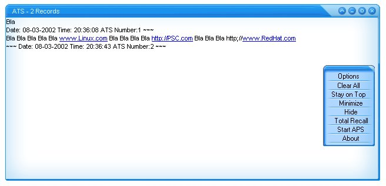

<div align="center">

## URL in a RichTextBox


</div>

### Description

.:. URL in a RichTextBox .:.

[www. - http:// - mailto: - ftp://]

You can Copy and Paste this Code in your Project, or you can Download a Example.
 
### More Info
 


<span>             |<span>
---                |---
**Submitted On**   |2002-08-04 18:58:08
**By**             |[\.:::aSerb:::\.](https://github.com/Planet-Source-Code/PSCIndex/blob/master/ByAuthor/aserb.md)
**Level**          |Intermediate
**User Rating**    |4.4 (31 globes from 7 users)
**Compatibility**  |VB 5\.0, VB 6\.0
**Category**       |[Coding Standards](https://github.com/Planet-Source-Code/PSCIndex/blob/master/ByCategory/coding-standards__1-43.md)
**World**          |[Visual Basic](https://github.com/Planet-Source-Code/PSCIndex/blob/master/ByWorld/visual-basic.md)
**Archive File**   |[URL\_in\_a\_R114288842002\.zip](https://github.com/Planet-Source-Code/aserb-url-in-a-richtextbox__1-37603/archive/master.zip)

### API Declarations

```
'**************************************
' Name: URL in a RichTextBox
' Description:URL in a RichTextBox
' By: .:::aSerb:::.
'
'1. Copy and Paste All of this Code into
'  a new project
'2. Make a RichTextBox and your done!
'Note: If your a newbie play around with this code!
' But only where I posted comments and read all of them!
Option Explicit
Private Const TVM_SETBKCOLOR = 4381&
Private Const EM_CHARFROMPOS& = &HD7
Private Declare Function ShellExecute Lib "shell32.dll" Alias _
"ShellExecuteA" _
(ByVal hwnd As Long, ByVal lpOperation As String, ByVal lpFile As String, _
ByVal lpParameters As String, ByVal lpDirectory As String, ByVal nShowCmd _
As Long) As Long
Private Declare Function SendMessage Lib "User32" Alias "SendMessageA" _
(ByVal hwnd As Long, ByVal wMsg As Long, ByVal wParam As Long, lParam As _
Any) As Long
Private Type POINTAPI
X As Long
Y As Long
End Type
Private hyperlink As String
Private Sub Form_Load()
On Error Resume Next
RichTextBox1.LoadFile App.Path & "\SOMEFILENAME.rtf" ' or App.path & "\SomeFileName"
highlightHyperlink
'Updates the RichTextBox1 and checks to
'   see if the URL is BLUE and UNDERLINED
'To Make other Changes see Private Sub h
'   ighlightHyperlink()
End Sub
Public Function getHyperlink(X As Single, Y As Single) As String
'Some Tips that is Safe to Change/Edit f
'   or Beginers:
'=======================================
'   =========================
' RichTextBox1.MousePointer = rtfCustom
'^^^^^^^^^^^^^^^^^^^^^^^^^^^^^^^^^^^^^^
' What MousePointer to Use ? if its rtfC
'   ustom
' Then you need to add a Icon to the Ric
'   hTextBox
'=======================================
'   =========================
'=======================================
'   =========================
'RichTextBox1.SelUnderline = True
' Do you want the URl to UnderLine ?
'=======================================
'   =========================
'=======================================
'   =========================
'RichTextBox1.SelColor = vbBlue
' What Color would you like the URL to b
'   e ?
'=======================================
'   =========================
On Error Resume Next
Dim point As POINTAPI
Dim charpos As Long
Dim pos_start As Long
Dim pos_end As Long
Dim char As String
Dim word As String
point.X = X \ Screen.TwipsPerPixelX
point.Y = Y \ Screen.TwipsPerPixelY
charpos = SendMessage(RichTextBox1.hwnd, EM_CHARFROMPOS, 0&, point)
If charpos <= 0 Or charpos = Len(RichTextBox1.Text) Then
RichTextBox1.MousePointer = rtfDefault
getHyperlink = vbNullString
Exit Function
End If
For pos_start = charpos To 1 Step -1
If Mid$(RichTextBox1.Text, pos_start + 1, 1) = Chr$(13) Then
RichTextBox1.MousePointer = rtfDefault
getHyperlink = vbNullString
Exit Function
End If
char = Mid$(RichTextBox1.Text, pos_start, 1)
If char = Chr$(32) Or char = Chr$(10) Or char = Chr$(13) Then Exit For
Next pos_start
pos_start = pos_start + 1
For pos_end = charpos To Len(RichTextBox1.Text)
char = Mid$(RichTextBox1.Text, pos_end, 1)
If char = Chr$(32) Or char = Chr$(10) Or char = Chr$(13) Then Exit For
Next pos_end
pos_end = pos_end - 1
If pos_start <= pos_end Then word = LCase$(Mid$(RichTextBox1.Text, pos_start, _
pos_end - pos_start + 1))
If Left$(word, 7) = "http://" Or Left$(word, 4) = "www." Or Left$(word, 6) = _
"ftp://" Or Left$(word, 7) = "mailto:" Then
char = Right$(word, 1)
Do While char = "." Or char = "," Or char = "!" Or char = "?"
If Len(char) = 0 Then Exit Do
word = Left$(word, Len(word) - 1)
char = Right$(word, 1)
Loop
If Len(word) < 4 Then
RichTextBox1.MousePointer = rtfCustom
getHyperlink = vbNullString
Else
RichTextBox1.MousePointer = rtfCustom
getHyperlink = word
End If
Else
RichTextBox1.MousePointer = rtfDefault
End If
End Function
Private Sub highlightHyperlink()
On Error Resume Next
Dim pos As Long
Dim posEnd As Long
Dim char As String
Dim link As String
pos = InStr(1, LCase$(RichTextBox1.Text), "mailto:")
Do While pos > 0
For posEnd = pos To Len(RichTextBox1.Text)
char = Mid$(RichTextBox1.Text, posEnd, 1)
If char = Chr$(32) Or char = Chr$(10) Or char = Chr$(13) Then Exit _
For
Next posEnd
link = Mid$(RichTextBox1.Text, pos, posEnd - pos)
char = Right$(link, 1)
Do While char = "." Or char = "," Or char = "!" Or char = "?" Or _
Len(char) <> 1
link = Left$(link, Len(link) - 1)
char = Right$(link, 1)
Loop
If Len(link) > 7 Then
RichTextBox1.SelStart = pos - 1
RichTextBox1.SelLength = Len(link)
RichTextBox1.SelUnderline = True
RichTextBox1.SelColor = vbBlue
End If
pos = InStr(posEnd + 1, LCase$(RichTextBox1.Text), "ftp://")
Loop
pos = InStr(1, LCase$(RichTextBox1.Text), "ftp://")
Do While pos > 0
For posEnd = pos To Len(RichTextBox1.Text)
char = Mid$(RichTextBox1.Text, posEnd, 1)
If char = Chr$(32) Or char = Chr$(10) Or char = Chr$(13) Then Exit _
For
Next posEnd
link = Mid$(RichTextBox1.Text, pos, posEnd - pos)
char = Right$(link, 1)
Do While char = "." Or char = "," Or char = "!" Or char = "?" Or _
Len(char) <> 1
link = Left$(link, Len(link) - 1)
char = Right$(link, 1)
Loop
If Len(link) > 6 Then
RichTextBox1.SelStart = pos - 1
RichTextBox1.SelLength = Len(link)
RichTextBox1.SelUnderline = True
RichTextBox1.SelColor = vbBlue
End If
pos = InStr(posEnd + 1, LCase$(RichTextBox1.Text), "ftp://")
Loop
pos = InStr(1, LCase$(RichTextBox1.Text), "http://")
Do While pos > 0
For posEnd = pos To Len(RichTextBox1.Text)
char = Mid$(RichTextBox1.Text, posEnd, 1)
If char = Chr$(32) Or char = Chr$(10) Or char = Chr$(13) Then Exit _
For
Next posEnd
link = Mid$(RichTextBox1.Text, pos, posEnd - pos)
char = Right$(link, 1)
Do While char = "." Or char = "," Or char = "!" Or char = "?" Or _
Len(char) <> 1
link = Left$(link, Len(link) - 1)
char = Right$(link, 1)
Loop
If Len(link) > 7 Then
RichTextBox1.SelStart = pos - 1
RichTextBox1.SelLength = Len(link)
RichTextBox1.SelUnderline = True
RichTextBox1.SelColor = vbBlue
End If
pos = InStr(posEnd + 1, LCase$(RichTextBox1.Text), "http://")
Loop
pos = InStr(1, LCase$(RichTextBox1.Text), "www.")
Do While pos > 0
For posEnd = pos To Len(RichTextBox1.Text)
char = Mid$(RichTextBox1.Text, posEnd, 1)
If char = Chr$(32) Or char = Chr$(10) Or char = Chr$(13) Then Exit _
For
Next posEnd
link = Mid$(RichTextBox1.Text, pos, posEnd - pos)
char = Right$(link, 1)
Do While char = "." Or char = "," Or char = "!" Or char = "?" Or _
Len(char) <> 1
link = Left$(link, Len(link) - 1)
char = Right$(link, 1)
Loop
If Len(link) > 4 Then
RichTextBox1.SelStart = pos - 1
RichTextBox1.SelLength = Len(link)
RichTextBox1.SelUnderline = True
RichTextBox1.SelColor = vbBlue
End If
pos = InStr(posEnd + 1, LCase$(RichTextBox1.Text), "www.")
Loop
RichTextBox1.SelStart = Len(RichTextBox1.Text)
End Sub
Private Sub RichTextBox1_MouseMove(Button As Integer, Shift As Integer, X As _
Single, Y As Single)
On Error Resume Next
hyperlink = getHyperlink(X, Y)
End Sub
Private Sub RichTextBox1_MouseUp(Button As Integer, Shift As Integer, X As _
Single, Y As Single)
On Error Resume Next
If Button = vbLeftButton Then
If Len(hyperlink) > 0 Then
ShellExecute Me.hwnd, "Open", hyperlink, vbNullString, vbNullString, _
vbHide
End If
End If
End Sub
'Private Sub RichTextBox1_Change()
'highlightHyperlink
'End Sub
Private Sub RichTextBox1_KeyPress(KeyAscii As Integer)
' What the Code Says is: If the user(s) press Enter
' The highlightHyperlink Command will Enable and Update.
If KeyAscii = 13 Then ' 13 is Enter
highlightHyperlink
Else
' If the user(s) press andthing ELSE END and do NOTING.
End If
End Sub
```


